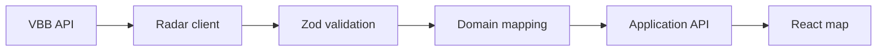

# Berlin Transit Live

Berlin Transit Live is a TypeScript application for visualizing estimated U-Bahn and S-Bahn vehicle positions on an interactive Berlin map.

The project uses the VBB Transport API, validates external data at runtime, converts it into stable domain models, and presents it through a responsive React interface. It is being developed incrementally, with an emphasis on reliable data boundaries, automated testing, and maintainable architecture.

> Vehicle positions supplied by VBB can be derived from schedules, route geometry, delays, and operational data. They should be understood as live estimates, not guaranteed GPS coordinates.

## Current status

Stage 7 is focused on the VBB radar integration. The current implementation includes:

- Strict TypeScript domain and VBB data types
- Zod validation for untrusted radar responses
- Mapping from VBB movements to application vehicles
- A dedicated HTTP error model
- Configurable radar URL construction
- Optional request cancellation with `AbortSignal`
- Unit tests for URL construction, successful responses, HTTP failures, signal forwarding, mapping, and invalid data

The map interface, GraphQL API, live subscriptions, persistence, and analytics are planned for later stages.

## Planned features

- Interactive Berlin map powered by OpenLayers
- Estimated U-Bahn and S-Bahn vehicle positions
- Filters by transport mode and line
- Vehicle details including direction, delay, and update time
- Station search and live departures
- Service disruption and data-freshness indicators
- Responsive desktop and mobile layouts
- Live updates without full-page refreshes
- Historical delay analysis in a later release

## Technology

| Area | Technology |
| --- | --- |
| Language | TypeScript |
| Web application | React, Vite |
| Styling | Tailwind CSS |
| Mapping | OpenLayers |
| External data | VBB Transport API |
| Runtime validation | Zod |
| API | Node.js, GraphQL Yoga |
| Live updates | GraphQL over Server-Sent Events |
| Testing | Vitest, Testing Library, Playwright |
| Planned persistence | PostgreSQL, Prisma |
| Planned caching | Redis |

## Data flow



External responses enter the application as `unknown`. Zod validates the response before a mapper converts it into the internal `TransitVehicle` model. This prevents untrusted API data from leaking into the rest of the application.

## Project structure

The project keeps external API types, domain models, and presentation concerns separate:

```text
src/
├── domain/                 # Application models
├── integrations/
│   └── vbb/                # VBB types, schemas, client, mapper, and tests
├── features/               # User-facing application features
└── shared/                 # Reusable application code
```

The exact structure will evolve as the GraphQL API and web interface are introduced.

## Getting started

### Prerequisites

- Node.js 22 or newer
- npm
- Git

### Installation

```bash
git clone git@github.com:Shushovan015/Berlin-Transit-live.git
cd berlin-transit-live
npm install
npm run dev
```

## Available scripts

| Command | Purpose |
| --- | --- |
| `npm run dev` | Start the Vite development server |
| `npm test` | Run the test suite |
| `npm run lint` | Run static analysis |
| `npm run build` | Type-check and create a production build |
| `npm run preview` | Preview the production build locally |

## Engineering principles

- Treat network responses as `unknown` until validated.
- Keep VBB transport models separate from application domain models.
- Use explicit return types for exported functions.
- Avoid `any` and unsafe type assertions.
- Preserve nullable and optional data instead of inventing fallback values.
- Test behavior without depending on the live VBB service.
- Add infrastructure only when the application needs it.

## Roadmap

1. **VBB boundary:** fetch, validate, map, and test vehicle data.
2. **Application API:** expose validated vehicles through GraphQL queries.
3. **Map interface:** render vehicles in React with OpenLayers.
4. **Live updates:** poll centrally and stream changes over SSE.
5. **Transit context:** add stations, departures, and disruptions.
6. **History and analytics:** introduce persistence, caching, and delay insights.
7. **Production readiness:** add CI, monitoring, accessibility checks, and deployment documentation.

## Data sources and attribution

Transit data is provided through the [VBB Transport REST API](https://v6.vbb.transport.rest/). Map tiles and geographic data must display the attribution required by the selected provider.

Review the applicable data and map-provider terms before deploying the application publicly or commercially.

## Contributing

Keep changes focused and include tests for behavioral changes. Before opening a pull request, run:

```bash
npm test
npm run lint
npm run build
```

## License

A source-code license has not yet been selected. Third-party data and map services remain subject to their own licenses and attribution requirements.
